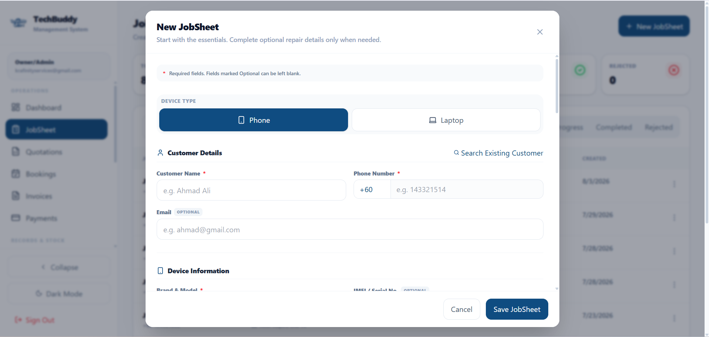
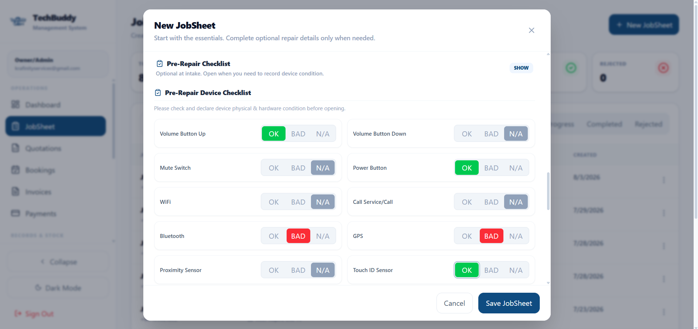
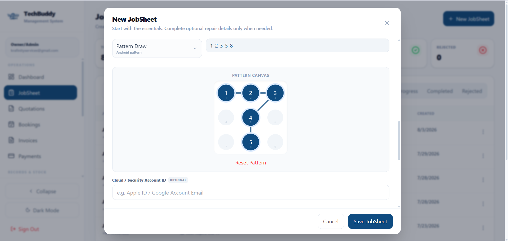
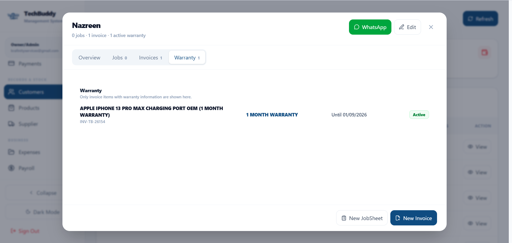
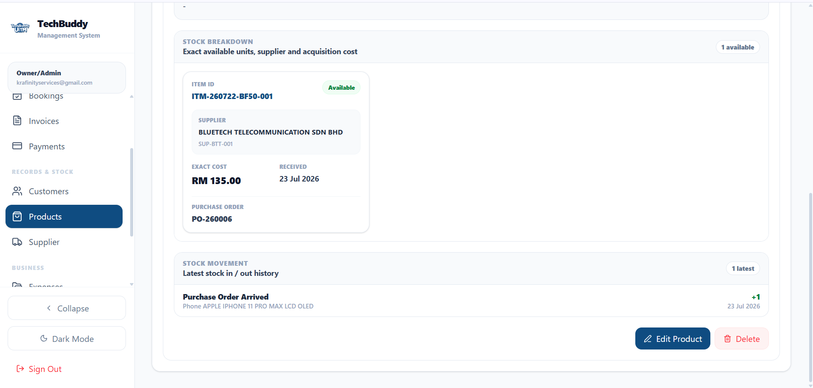

# TechBuddy Management System

### Custom Repair Business Management System

A case study of a custom business management platform built around the operational workflow of a technology repair business.

The system was designed to replace fragmented manual processes with a structured workflow covering customer intake, repair tracking, stock traceability, warranty, supplier records, invoicing, payments, and business operations.

> This repository is a portfolio case study. Production source code and sensitive business data are kept private.

---

## Business Problem

Repair businesses often rely on a mix of messaging apps, spreadsheets, paper records, and separate tools to manage repairs.

This creates problems such as:

- Difficult repair status tracking
- Scattered customer records
- Inconsistent repair intake procedures
- Poor stock and supplier traceability
- Warranty information being difficult to retrieve
- Manual quotation and invoicing workflows
- Limited visibility into business operations

The goal was to create one structured system that reflects how a repair business actually operates.

---

## Solution

TechBuddy Management System provides a centralized workflow for managing:

- Jobsheets and repair progress
- Customer and device records
- Pre-repair device condition checks
- Device access and security information
- Quotations
- Invoices and payments
- Warranty tracking
- Products and services
- Inventory
- Suppliers and purchase records
- Expenses
- Payroll
- Operational reporting

## Interface Highlights

### Jobsheet Intake

Customer and device intake workflow with essential repair information and structured service records.

### Pre-Repair Checklist

Repair-specific SOP checklist for recording device condition before service.

### Device Security

Internal device access record designed for repair testing workflows.

### Customer Warranty

Customer warranty history linked to repair items and invoice records.

### Inventory Traceability

Item-level stock tracking with supplier, exact cost, purchase order, grade, and warranty references.

---

## Repair-Specific Workflow

Unlike a generic inventory or CRM system, the platform includes features designed specifically for repair operations.

### Jobsheet Management

Each repair job can contain:

- Customer details
- Device information
- Reported problem
- Diagnosis
- Repair progress
- Accessories received
- Staff handling the device
- Repair checklist
- Final status

### Pre-Repair Checklist

Technicians can record hardware and device condition before repair.

Examples include:

- Power buttons
- Volume controls
- Wi-Fi
- Bluetooth
- Sensors
- Other hardware functions

This creates a clearer intake record before work begins.

### Device Security Records

The system supports recording device access information when required for testing, including Android pattern input.

Sensitive information is kept inside the internal system and is not exposed through customer-facing tracking.

---

## Inventory & Supplier Traceability

Repair inventory is not always suitable for standard FIFO workflows.

The system tracks stock at individual item level using a unique Item ID.

Each item can be linked to:

- Supplier
- Purchase order
- Exact acquisition cost
- Product grade
- Warranty
- Stock status

This allows technicians to identify exactly which component was used for a repair and where it originated.

---

## Customer Warranty Tracking

Warranty information is connected to customer and invoice records.

The system can display:

- Covered repair item
- Warranty duration
- Invoice reference
- Warranty expiry date
- Active or expired status

This makes after-service support easier to manage.

---

## Customer-Facing Service Tracking

Customers can check repair progress using their jobsheet or invoice reference together with verification details.

Only essential service information is displayed.

Internal technician notes, device passwords, and sensitive operational data remain private.

---

## Technology

- React
- JavaScript
- Supabase
- PostgreSQL
- Vercel
- GitHub

---

## Design Approach

The interface was designed around several principles:

- Clear operational workflows
- Simple data entry
- Repair-specific functionality
- Responsive layouts
- Privacy-conscious customer access
- Modular system structure
- Ability to expand as the business grows

---

## Project Status

The system is actively developed and refined based on real operational requirements.

This case study represents selected modules and workflows rather than the complete production application.

---

## Source Code

Production source code is private.

This public repository exists to document the project architecture, workflow decisions, and selected interface examples for portfolio purposes.

---

## Developed by

**Krafinity Services**

Custom Business Systems · Web Applications · Digital Solutions
