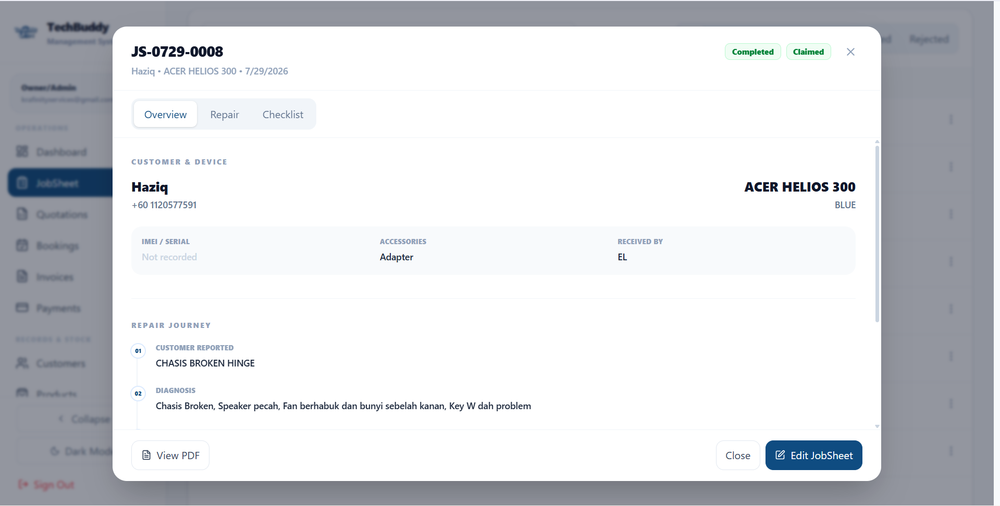

# TechBuddy Management System

### Custom Repair Business Management System

A modular business operations platform built around the real workflow of a technology repair business.

 

 

**Repair Workflow · Inventory Traceability · Warranty · Finance · Customer Tracking**

---

## Overview

TechBuddy Management System is a custom business platform designed to centralize the operational workflow of a technology repair business.

Instead of relying on separate spreadsheets, messaging apps, paper records, and disconnected tools, the system brings repair operations into one structured environment.

> Production source code and sensitive business data are kept private.

---

## Business Problem

Repair businesses often manage different parts of their operation using different tools.

This can lead to:

| Operational Issue | Impact |
|---|---|
| Scattered customer records | Difficult service history tracking |
| Manual repair records | Inconsistent jobsheet information |
| Weak stock traceability | Hard to identify supplier, cost, or warranty |
| Separate quotation and invoice processes | More repetitive data entry |
| Poor warranty visibility | Slower after-service support |
| Manual reporting | Limited business visibility |
| WhatsApp-heavy communication | Repetitive customer follow-up |

The goal was to create one system that follows the actual workflow of a repair operation.

---

## Solution

TechBuddy Management System provides a centralized environment for managing:

### Service Operations
- Jobsheets
- Repair progress
- Customer records
- Device records
- Pre-repair condition checks
- Device access information
- Warranty tracking

### Sales & Finance
- Quotations
- Invoices
- Payments
- Expenses
- Payroll

### Inventory & Supply
- Products and services
- Inventory
- Suppliers
- Purchase records
- Item-level stock traceability

### Operations
- Internal records
- Service tracking
- Business reporting
- Modular workflow management

---

## Operational Workflow

**Customer Intake**  
↓  
**Device & Condition Recording**  
↓  
**Diagnosis**  
↓  
**Quotation**  
↓  
**Repair Progress**  
↓  
**Inventory Usage**  
↓  
**Invoice & Payment**  
↓  
**Warranty & After-Service**

The system is designed so information flows through the repair lifecycle instead of being repeatedly entered into separate tools.

---

# Interface Highlights

## Jobsheet Intake

Customer and device intake workflow with structured service information, repair notes, device details, and operational records.

---

## Pre-Repair Checklist

Repair-specific SOP checklist for documenting device condition before service begins.

This helps create a clearer record of the device condition during intake.

---

## Device Security

Internal device access record supporting PIN, password, or Android pattern input when technician access is required for testing.

Sensitive information remains inside the internal workflow.

---

## Customer Warranty

Warranty history connected to repair items and invoice records.

The system can track warranty duration, expiry dates, invoice references, and active warranty status.

---

## Inventory Traceability

Individual stock items can be traced back to supplier, acquisition cost, purchase order, grade, warranty, and stock status.

---

## Customer-Facing Service Tracking

Public repair-status access connected to internal service records while exposing only customer-safe information.

---

## Repair-Specific Workflow

Unlike a generic CRM or inventory system, TechBuddy includes logic designed around repair operations.

### Jobsheet Management

Each repair record can contain:

| Category | Information |
|---|---|
| Customer | Contact and customer information |
| Device | Model, serial or IMEI, color, accessories |
| Repair | Reported problem, diagnosis, repair notes |
| Workflow | Progress, technician, current status |
| Intake | Device condition and checklist |
| Security | Required device access information |
| Completion | Final repair status |

---

## Pre-Repair SOP

Technicians can document hardware and device condition before repair.

Examples include:

- Power buttons
- Volume controls
- Wi-Fi
- Bluetooth
- Sensors
- Display condition
- Camera
- Speakers
- Charging functionality
- Other device functions

This creates a structured condition record before technicians begin work.

---

## Inventory & Supplier Traceability

Repair inventory does not always fit a simple generic FIFO workflow.

TechBuddy tracks inventory at individual-unit level using unique Item IDs.

Each unit can be associated with:

| Data | Purpose |
|---|---|
| Item ID | Identify the exact physical stock unit |
| Supplier | Track where the component originated |
| Purchase Order | Connect stock to procurement |
| Acquisition Cost | Record actual item cost |
| Product Grade | Differentiate quality or condition |
| Warranty | Track supplier or item coverage |
| Status | Available, reserved, used, or other state |

This allows the system to identify exactly which component was used in a repair.

---

## Customer Warranty Tracking

Warranty information is connected directly to customer and invoice history.

The system can display:

- Covered repair item
- Warranty duration
- Invoice reference
- Warranty start
- Warranty expiry
- Active or expired status

This provides clearer after-service support without relying on manual warranty records.

---

## Customer-Facing Service Tracking

Customers can access selected repair information using service verification details.

A simplified flow:

**Jobsheet / Invoice Reference**  
↓  
**Customer Verification**  
↓  
**Service Record Validation**  
↓  
**Repair Status Display**

Only essential service information is exposed publicly.

Internal notes, device credentials, supplier information, cost data, and technician-only records remain private.

---

## Core Modules

| Module | Purpose |
|---|---|
| Dashboard | Business overview and operational visibility |
| Jobsheet | Repair intake and service workflow |
| Quotations | Repair quotation management |
| Bookings | Customer appointment management |
| Invoices | Billing and service records |
| Payments | Payment tracking |
| Customers | Customer and repair history |
| Inventory | Item-level stock control |
| Suppliers | Procurement and supplier records |
| Warranty | Repair warranty monitoring |
| Expenses | Business expense records |
| Payroll | Staff payroll workflow |
| Reporting | Operational and financial visibility |

---

## Technology

`React` · `JavaScript` · `Supabase` · `PostgreSQL` · `Vercel` · `GitHub`

### Frontend

React is used to build the modular application interface and responsive operational workflows.

### Backend & Database

Supabase and PostgreSQL manage structured business records, relational data, authentication, and system logic.

### Deployment

The production web application is deployed through Vercel with GitHub-based version control.

---

## Design Principles

### Business-First

The system follows the real operational workflow rather than forcing the business into a generic software template.

### Repair-Specific

Features such as device condition recording, warranty history, device access records, and item-level parts tracking are designed specifically for repair operations.

### Modular

Modules can evolve independently as operational requirements grow.

### Traceable

Important records can be connected across customers, jobsheets, invoices, inventory, suppliers, and warranty history.

### Privacy-Conscious

Customer-facing interfaces expose only the information required for the customer experience.

### Responsive

The interface is designed to remain practical across different screen sizes and operating environments.

---

## Project Status

🟢 **Active Development**

TechBuddy Management System continues to evolve based on real operational requirements.

The system includes additional modules, workflows, and business logic beyond what is shown in this public case study.

---

## Source Code

🔒 **Private Production Repository**

The production source code and operational database are not publicly available.

This repository exists as a portfolio and technical case study showcasing selected:

- Product interfaces
- Business workflows
- Repair-specific logic
- Database concepts
- Operational architecture
- System design decisions

---

## Krafinity Services

**Custom Business Systems · Web Applications · Digital Solutions**

Built around real business workflows.

